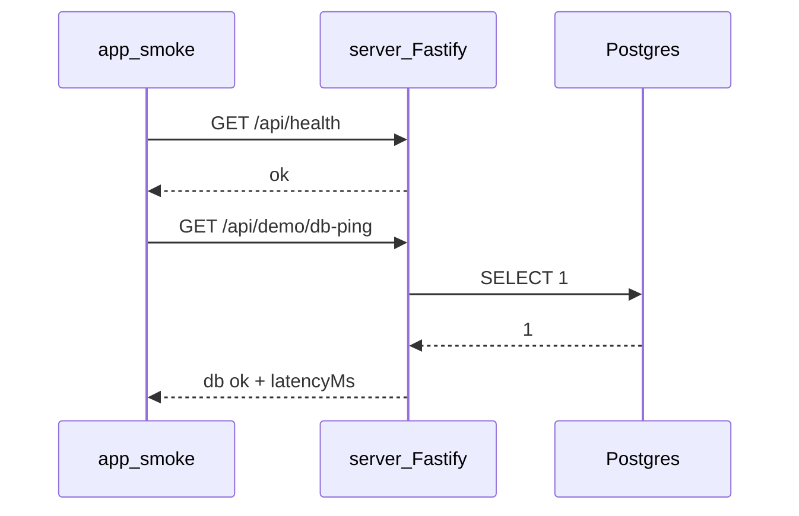

# Франкенштейн: план

Актуально на 2026-08-12. Этап 1 — инфраструктура без лаб тем.

## Overview

Этап 1: монорепо `server` + Postgres + smoke UI; убрать лабу 24; обновить скилл лаб (визуализации + анимации в общем стиле). Лабы тем — следующие итерации.

## Todos (этап 1)

- [ ] Структура `server/` (Fastify+Drizzle), docker-compose Postgres, env examples, корневые scripts
- [ ] Vite proxy + apiBase; `/health` и `/api/demo/*` (echo + db-ping); минимальный smoke UI на фронте
- [ ] Убрать лабу `24-devtools-lighthouse` (TopicPage, hasLab, файлы `topics/performance` lab)
- [ ] Дописать `write-assessment-labs` + расширить `assessment-lab-visualizations` (общий стиль) + якорь в `LAB_FORMAT`
- [ ] README (локальный запуск треугольника) + черновик деплоя Pages+Render/Neon на ≥7 дней

---

# Франкенштейн: этап 1 — инфраструктура (без лаб)

## Решения по фидбеку

1. **Структура своя**, не клон meme-app — тот репо только пример «всё в одном месте».
2. **Лабу** темы «Инструмент проверки производительности (DevTools, Lighthouse)» (`24-devtools-lighthouse`) **убираем** (junior; симуляция Lighthouse не нужна).
3. **Этап 1 — только связка** frontend ↔ API ↔ DB. Лабы тем не пишем.
4. В скилл написания лаб — правило про **визуализации + анимации** (когда уместно) и **единый стиль**.
5. Ниже — **бэклог тем** под API/БД для следующих итераций.

## Целевая структура (этап 1)

```
assessment/
  app/                 # существующий Vite/React (не переименовываем)
  server/              # Fastify API + Drizzle
    src/
      index.ts
      db.ts
      routes/health.ts
      routes/demo.ts   # smoke: echo + db-ping
    drizzle/
  docker-compose.yml   # только Postgres
  .env.example
  README.md            # как поднять треугольник
```

Стек: **Node + Fastify + Postgres + Drizzle**. Один язык с учебным фронтом; позже security/Node-лабы лягут на тот же `server/`.

Корень без обязательного npm-workspaces: `app/` и `server/` — отдельные `package.json`; в README две команды dev (+ `docker compose up -d`).

## Что доказываем на этапе 1



- Postgres из Compose.
- `server` слушает `:3000`, CORS для `localhost` (и заготовка под Pages origin).
- В Vite — proxy `/api` → `http://localhost:3000`.
- На фронте — **минимальный smoke** (не лаба темы): например блок на главной или `/#/dev/api-smoke` с двумя кнопками и логом ответа. Цель — увидеть живой ответ API и БД, не учебный сценарий темы.
- Prod: `VITE_API_BASE_URL` на URL API.

Деплой (документация, без обязательного раската в этом же PR): Pages (фронт) + Render/Fly (API) + Neon или Render Postgres (≥7 дней).

## Удаление лабы 24

- Убрать ветку в [`app/src/pages/TopicPage.tsx`](../app/src/pages/TopicPage.tsx) и `hasLab` для `24-devtools-lighthouse` в [`app/src/content/parseTopicMd.ts`](../app/src/content/parseTopicMd.ts).
- Удалить [`app/src/topics/performance/`](../app/src/topics/performance/) (PerformanceLab и сателлиты).
- Теорию `topics/24-devtools-lighthouse.md` оставить.

## Скилл лаб: визуализации и анимации (этап 1, доки)

Сейчас [`assessment-lab-visualizations`](../skills/assessment-lab-visualizations/SKILL.md) заточен под algorithms. Нужно обобщить и связать с [`write-assessment-labs`](../skills/write-assessment-labs/SKILL.md).

**В `write-assessment-labs/SKILL.md` добавить раздел**, примерно:

- Если механизм темы **можно показать схемой/потоком** (запрос↔ответ, cookie, JWT, очередь, критический путь, SQL vs injection, WebSocket handshake и т.п.) — **делать визуализацию + короткие анимации**, чтобы студенту было видно «что происходит сейчас», а не только лог.
- Не ради декора: нет понятного состояния/перехода → визуализация не обязательна (достаточно кода + шагов).
- Стиль **только** по [`assessment-lab-visualizations`](../skills/assessment-lab-visualizations/SKILL.md) — не изобретать отдельный look на лабу.
- Уважать `prefers-reduced-motion`.
- Чеклист: пункт «если уместно — схема/анимация в общем стиле».

**В `assessment-lab-visualizations/SKILL.md`:**

- Расширить scope: не только algorithms, а **все** лабы (security, network, performance…).
- Зафиксировать общий визуальный язык (токены `--accent` / `--ok` / `--border` / `--bg-elevated`, тёмные панели, короткие GSAP/CSS transitions, без AI-фиолетового glow).
- Эталоны: оставить algorithms; добавить примечание, что новые live-API лабы переиспользуют тот же язык.
- Опционально позже: общий CSS-модуль/примитивы в `app/src/components/lab/viz/` — **не** в этапе 1, только правило в скилле; примитивы появятся с первой лабой, где нужна схема.

**В [`LAB_FORMAT.md`](../LAB_FORMAT.md)** — короткий якорь «Визуализации» со ссылкой на оба скилла (источник истины по формату лаб).

## Вне скоупа этапа 1

- Новые/переписанные лабы любых тем (кроме удаления 24).
- Роуты под CORS/JWT/SQL injection и т.д. (появятся с итерациями лаб).
- Массовый рерайт теории («Суть»).
- Общий React-kit визуализаций (`components/lab/viz`) — отложить до первой лабы со схемой.

---

## Бэклог: темы, где API / БД уместны

Критерий: без сети, заголовков ответа, cookie/сессии, WebSocket или SQL **нельзя** показать механизм темы. Иначе — только клиент (в список не входят).

Колонки: **API** / **DB** / **оба**.

### Производительность

| Тема | Нужно | Зачем |
|------|-------|-------|
| `27-server-performance-metrics` | оба | fast/slow/db endpoints, latency, RPS |
| `15-bundle-cdn` | API | Cache-Control / ETag / сжатие на ответе |
| `14-client-performance-metrics` | API (+DB опц.) | RUM: Lab vs Field, хранение samples |

Не в списке: `25-preload…`, `26-lazy…` — браузер; `24` — лабу убираем.

### Безопасность

| Тема | Нужно | Зачем |
|------|-------|-------|
| `07-cors` | API | реальные CORS-заголовки / preflight |
| `09-jwt-security` | API (+DB опц.) | выдача/проверка JWT, refresh |
| `10-csp` | API | отдача страницы/ресурса с CSP |
| `11-xss` | оба | stored XSS / отражение через API |
| `12-sql-injection` | оба | уязвимый vs параметризованный SQL |
| `13-csrf` | API (+DB/сессия) | cookie-сессия + мутации без/с CSRF-токеном |
| `151-x-frame-options` | API | заголовки framing |
| `154-websocket-security` | API | WS + origin/auth |
| `150-authn-authz` | оба | login, роли (junior — по желанию позже) |

Слабо/не тащим на API: `08-npm-audit`, `153-ssl-tls` (нужен реальный TLS-стенд), `155-tcp-hijacking`, `148`/`149` (в основном клиент).

### Браузер и веб-документы

| Тема | Нужно | Зачем |
|------|-------|-------|
| `62-websocket` | API | живой WS-эндпоинт |
| `63-cookies-server-httponly` | API | Set-Cookie HttpOnly |
| `64-cookie-security` | API | Secure / SameSite демо |
| `57-cookies` | API | серверные cookie-сценарии |
| `65-service-workers` | API (опц.) | кэшируемые ответы / offline sync |
| `70-pwa` | API (опц.) | background sync к API |

Не тащим: `66`–`69` (workers/IndexedDB/worklets) — клиент.

### NodeJS

| Тема | Нужно | Зачем |
|------|-------|-------|
| `243-nodejs-routing-static` | API | роутинг + static глазами клиента |
| `244-nodejs-db-async-config` | оба | async DB + config |
| `245-nodejs-cache-crud` | оба | CRUD + кеш-слой |
| `246-nodejs-worker-threads` | API | тяжёлая работа в worker за HTTP |

### Сеть

| Тема | Нужно | Зачем |
|------|-------|-------|
| `248-network-query-params` | API | разбор query на сервере |
| `249-network-rest` | API | REST-ресурсы |
| `250-network-http-https` | API | методы, статусы, заголовки |
| `251-network-api-first` | API | контракт API |
| `252-network-long-polling-ws-sse` | API | long-poll / WS / SSE |

Слабо: `247`, `253`, `254` (модель TCP/IP без выгодного интерактива в браузере).

### Логирование / мониторинг

| Тема | Нужно | Зачем |
|------|-------|-------|
| `146-logging-sentry-prometheus` | API | метрики/события с бэка |
| `147-logging-server-debug-browser` | API | inspect/debug-флаги на процессе API |
| `06-logging-nodes` | API (опц.) | уровни логов на запросах |

### Смежное (полезный API, не ядро темы)

| Тема | Нужно | Зачем |
|------|-------|-------|
| `124-redux-saga-thunk` | API | реальный async fetch вместо `api.example` |
| `214-async-xhr-fetch` | API | живой XHR/fetch |
| `194-react-form-managers` | API (+DB опц.) | submit + валидация/ошибки сервера |
| `192-react-ssr` | отдельный SSR-сервер | тяжелее обычного API — отдельное решение |

Не тащим «ради галочки»: git, algorithms, layout, чистый JS/TS/V8, большинство patterns/refactoring, module federation как мульти-хост (дорого).

### Порядок следующих итераций (после этапа 1)

1. Security + cookies/CORS/JWT/SQLi/CSRF (максимум пользы от живого API).
2. Network transport (REST / WS / SSE) + Node CRUD/DB.
3. Performance (`27`, затем `15` / RUM для `14`).
4. Точечно Redux/async/forms.

---

## Порядок работ этапа 1

1. `server/` + Compose + env + Drizzle schema минимум (`SELECT 1`).
2. Роуты `/api/health`, `/api/demo/echo`, `/api/demo/db-ping`.
3. Vite proxy + `apiBase` + smoke UI.
4. Удалить лабу 24.
5. Обновить скиллы лаб + якорь в `LAB_FORMAT.md` (визуализации / общий стиль).
6. README + заметка по деплою на неделю.
